##  ..........................................AWS LAMP STACK WITH NFS SERVER ................................

The aim of this project is to set up the below architecture using AWS
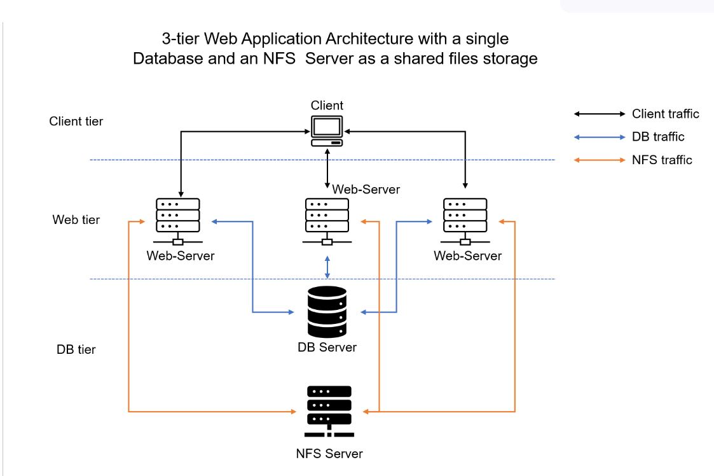

Let's set up a new EC2 instance with RHEL Linux 8 Operating System on AWS and attchs 3 volumes.
update the server by running the `sudo yum update -y` command

we will create LVM on the server using the attached volumes for our NFS.

Let's start by creating a lvm partiton on each of the volumes using the command `sudo gdisk /dev/xvdc` the press `n` to create a new partiton, accept the defaults but change the HEX code to ``8e00`` to select the `Linux LVM` partition type. press `w` to write the GPT data and type `y` to complete the operation.
Do this for all the 3 volumes.

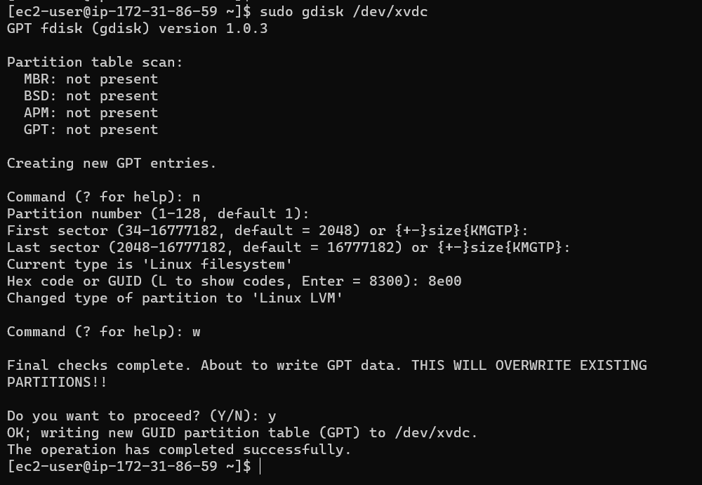


Now we start creating PVs, vgs amd lvs, use the command `sudo pvcreate ` `sudo vgcreate` and `sudo lvcreate` as shown below.

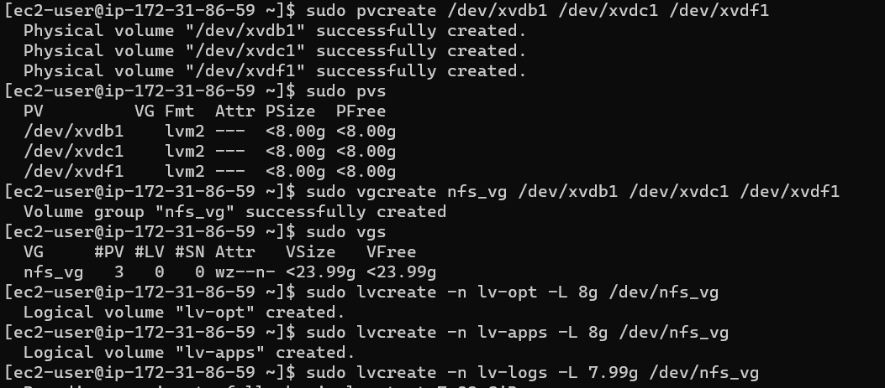

we will Create mount points on /mnt directory for the logical volumes as follow:

- Mount lv-apps on /mnt/apps – To be used by webservers
- Mount lv-logs on /mnt/logs – To be used by webserver logs
- Mount lv-opt on /mnt/opt – To be used by Jenkins server in a later project

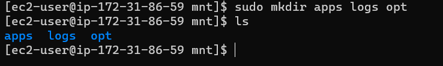

Next we will Install the NFS server, configure it to start on reboot and make sure it is u and running.

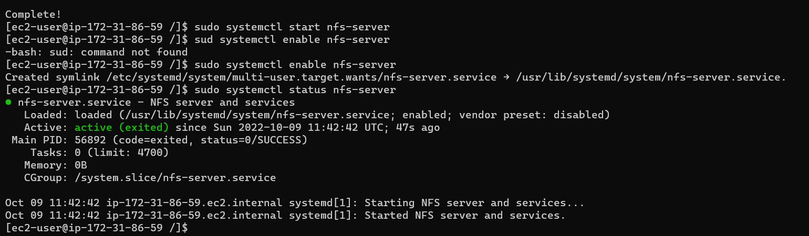

Before we export the mounts for webservers’ subnet cidr to enable connection as clients lets  allow our Web servers to read, write and execute files on NFS by modifying the permission on the directory/folder.

```
sudo chown -R nobody: /mnt/apps
sudo chown -R nobody: /mnt/logs
sudo chown -R nobody: /mnt/opt

sudo chmod -R 777 /mnt/apps
sudo chmod -R 777 /mnt/logs
sudo chmod -R 777 /mnt/opt

sudo systemctl restart nfs-server.service
```
we wil Configure access to NFS for clients within the same subnet as shown below. 

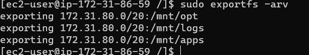

**Note:** In order for NFS server to be accessible from your client, you must also open following ports: TCP 111, UDP 111, UDP 2049 on the security group.

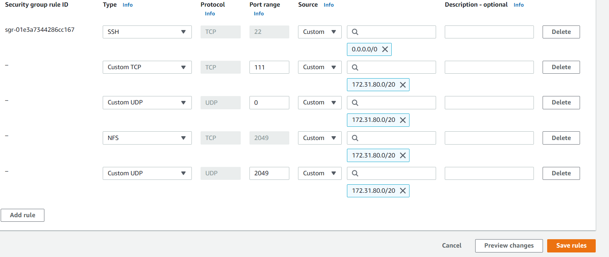

## .................... Configure Database Server ...........................

For our database configuration, we will carry out the following steps.

- Install MySQL server

```
sudo yum update -y
sudo yum install mysql-server
```
- start and enable the service

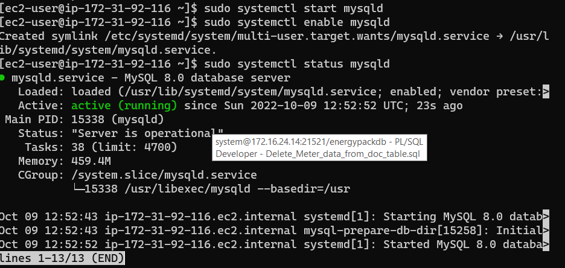

- Create a database and name it tooling
- Create a database user and name it webaccess
- Grant permission to webaccess user on tooling database to do anything only from the webservers subnet cidr


## ............ Prepare the Web Servers .......................

We need to make sure that our Web Servers can serve the same content from shared storage solutions, the NFS and Database Servers.

In order to make our web servers stateless, lets use the NFS and mount previously created Logical Volume lv-apps to the folder where Apache stores files to be served to the users (/var/www).

- Configure NFS client (this step must be done on all three servers)
- Deploy a Tooling application to our Web Servers into a shared NFS folder
- Configure the Web Servers to work with a single MySQL database

We will launch a EC2 VM with Redhat OS and install the NFS client.

`sudo yum install nfs-utils nfs4-acl-tools -y`

Let's mount the /var/www/ and target the NFS server’s export for apps.

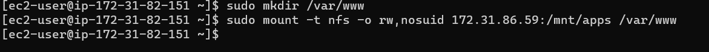

We will verify that NFS was mounted successfully by running ``df -h``. 

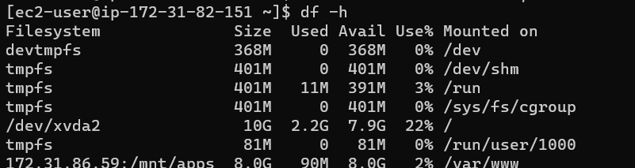

Make the changes persistent on the Web Server after reboot by modifying sudo vi /etc/fstab:
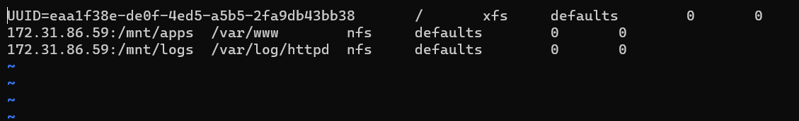

Install Remi’s repository, Apache and PHP

```
sudo yum install httpd -y

sudo dnf install https://dl.fedoraproject.org/pub/epel/epel-release-latest-8.noarch.rpm

sudo dnf install dnf-utils http://rpms.remirepo.net/enterprise/remi-release-8.rpm

sudo dnf module reset php

sudo dnf module enable php:remi-7.4

sudo dnf install php php-opcache php-gd php-curl php-mysqlnd

sudo systemctl start php-fpm

sudo systemctl enable php-fpm

setsebool -P httpd_execmem 1
```

we will repeat the server setup process for the two other servers. 

Locate the log folder ``/var/log/httpd ``for Apache on the Web Server and mount it to NFS server’s export for logs.

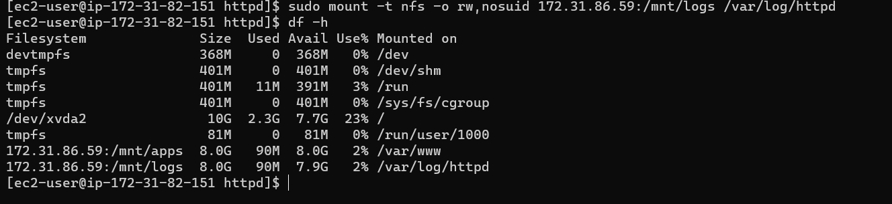
To make sure the mount point will persist after reboot
add it to the `etc/fstab` directory.


you can Fork the tooling source code from [my Github Account](https://github.com/yemveiser/tooling) to your Github account.

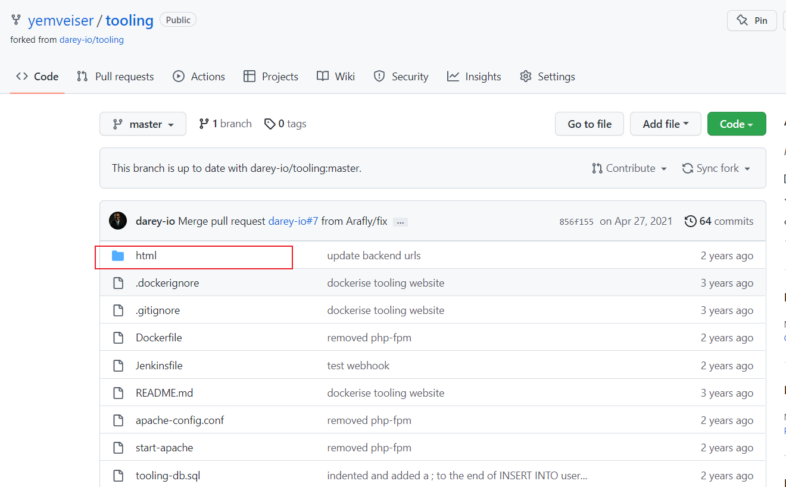

Clone the tooling website’s code to the Webserver. Ensure that the html folder from the repository is copied to /var/www/html

```
git clone https://github.com/yemveiser/tooling.git
sudo cp -R tooling/html /var/www
```
Ensure port 80 is opened on the webservers.

check permissions to your ``/var/www/html`` folder and also disable SELinux using the command ``sudo setenforce 0`` we can make this permanent by running the command ``sudo vi /etc/sysconfig/selinux`` and set ``SELINUX=disabled``then restrt httpd service.

## .......................Connecting to the datatbase.............................

Update the website’s configuration to connect to the database (in /var/www/html/functions.php file). Apply tooling-db.sql script to your database using this command

mysql -h <databse-private-ip> -u <db-username> -p <db-pasword> < tooling-db.sql. fill in the values as it relates to your architecture.

Create in MySQL a new admin user with username: myuser and password: Password

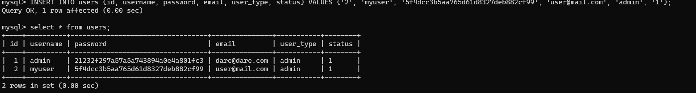

Open the website in your browser ``http://<Web-Server-Public-IP-Address-or-Public-DNS-Name>/index.php ``and make sure you can login into the websute with myuser user.

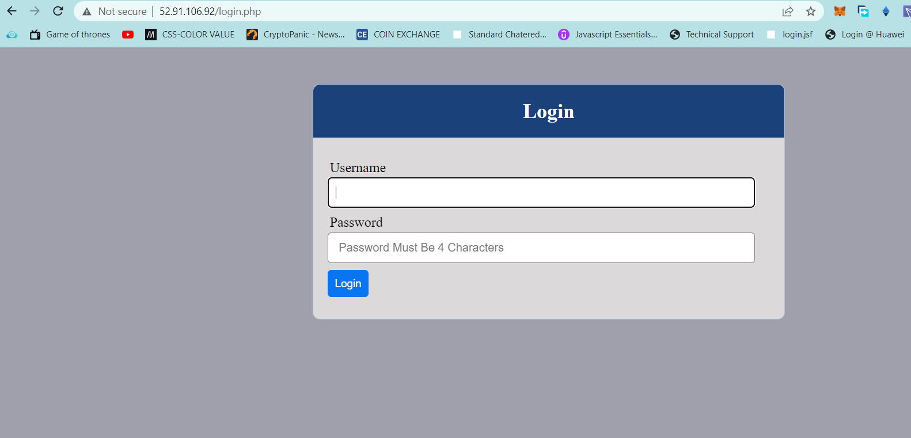

**Login Successfull!!**

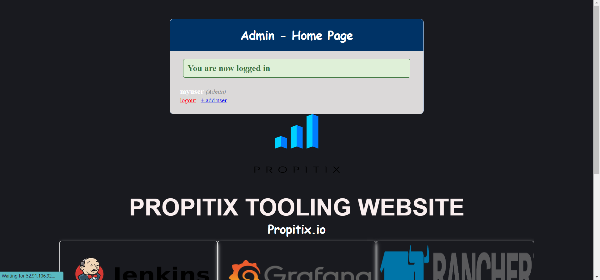


